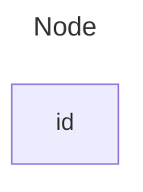

# E2E Testing of Rancher Manager Telemetry
### Patrick Seidensal -- pseidensal@suse.com

---

## Github Actions

- Github-hosted runners are visual machines
- An Action is also re-usable code (we don't have one)
- Actions can be shared across repositories
- Free of charge for public repositories
    - Alternatively: self-hosted runners
        - Rancher uses Drone quite frequently
- Tests live in `.github/workflows`

---

## Drone for Telemetry

---

## Github Actions for E2E in Telemetry

---

## Data flow

---

## Thank You

<!-- This presentation was created with

- Marp (Markdown Presentation Ecosystem)
- Mermaid.js for diagrams
- `gnome-screenshot`
- Visual Studio Code -->
