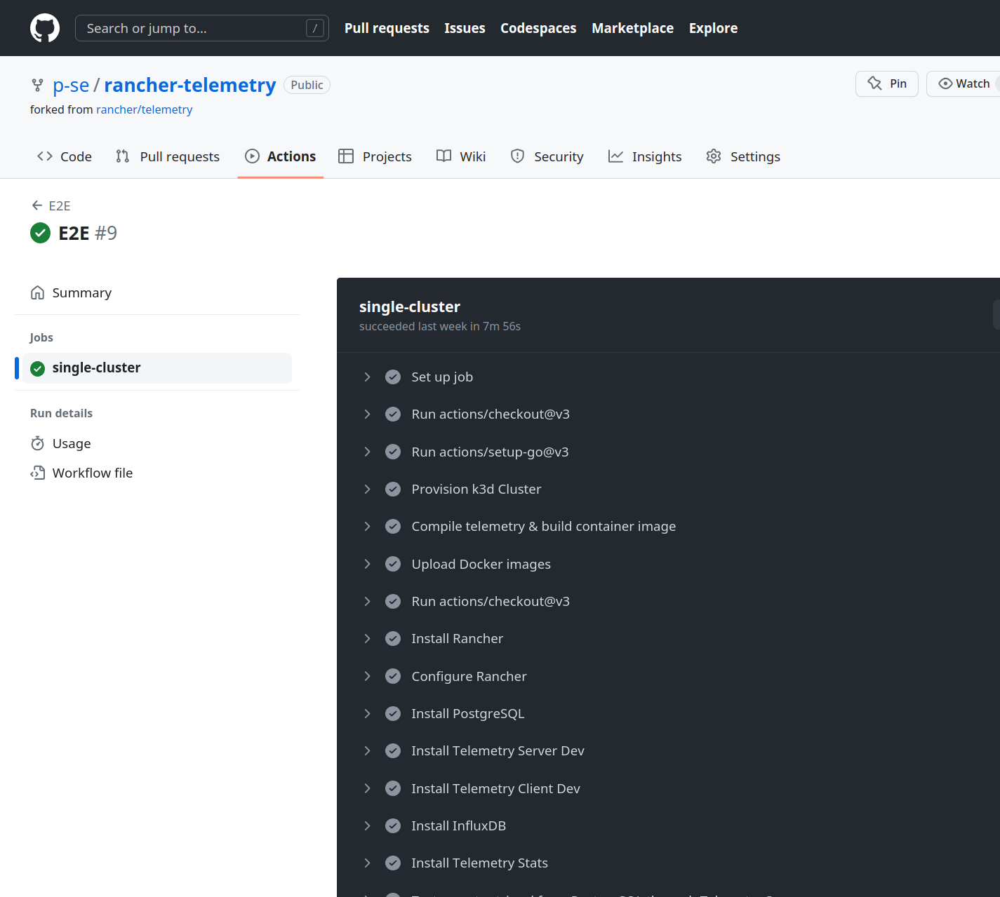
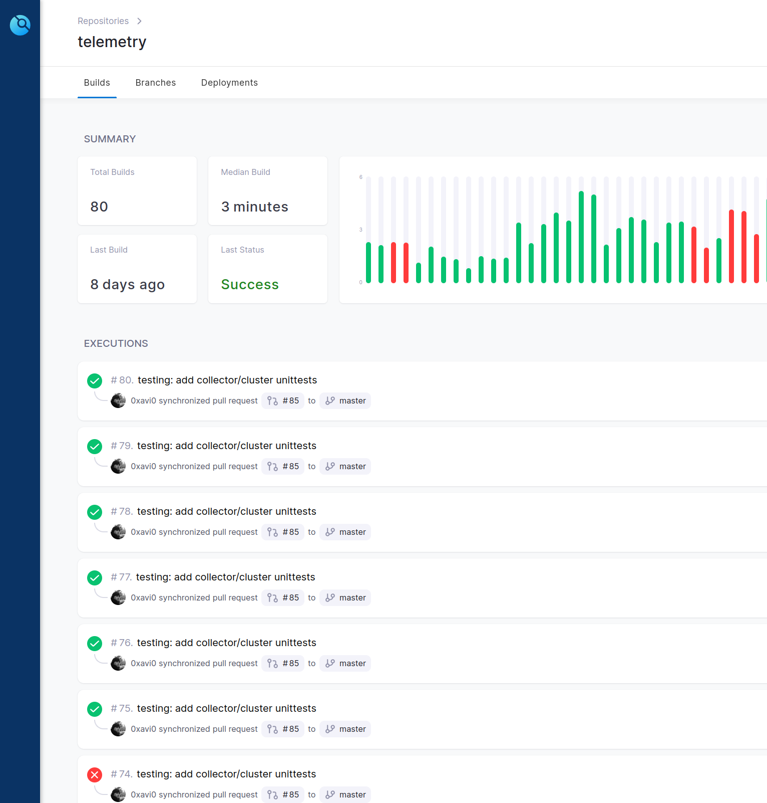

# E2E Testing of Rancher Manager Telemetry
### Patrick Seidensal -- pseidensal@suse.com

---
# Kubectl

Kubernetes provides a command line tool for communicating with a Kubernetes cluster's control plane, using the Kubernetes API.


---

# Kubectl

## Examples

- `kubectl apply -f deployment.yaml`
- `kubectl get all`
- `kubectl -n telemetry get job -o yaml`
- `kubectl delete deployment telemetry-server`

---

# Helm

## The package manager for Kubernetes

Helm is the best way to find, share, and use software built for Kubernetes.


---

# Helm

- Re-usable packages
- Templating for Manifests
- Versioning of Manifests
- Dependency management
- Reduced complexity
- Improved maintainability

---

# Helm

## Example

```console
helm install rancher rancher-stable/rancher \
  --set bootstrapPassword=admin \
  --namespace cattle-system \
  --set hostname="${HOST_NAME}" \
  --set replicas=1 \
  --atomic
```

---

# Kustomize

Kubernetes native configuration management


---

# Kustomize

- Built into `kubectl`
  - `kubectl apply -k folder/with/kustomization`
- Template-free
- Encourages fork/modify/rebase workflow

---

# Github Actions


---

## Github Actions

- Github-hosted runners are virtual machines
- An Action is also re-usable code (we don't have one)
- Actions can be shared across repositories
- Free of charge for public repositories
    - Limits apply to private repositories (2000 minutes/month)
- Tests (workflows) live in `.github/workflows`

---

### K3S is a Lightweight Kubernetes distribution


---

# K3s is *just* Kubernetes

Minus a few things

- some in-tree storage driver removed
- (deprecated) in-tree cloud providers removed
- alpha and non-default features removed

Plus a few things

- reduced file size
- built-in SQLite default data store
- support to use MySQL or PosteSQL instead of etcd, but still supports etcd
- built-in (but optional) Traefik Ingress controller
- built-in Helm controller

---

### K3D is a lightweight wrapper to run k3s in docker


---

# K3d Commands

- `k3d cluster list`
- `k3d cluster create foo`
- `k3d kubeconfig get > ~/.kube/config-foo`
  `kubectl get nodes -o wide`
- `k3d kubeconfig get > ~/.kube/config`
  `kubectl get nodes -o wide`
- `k3d cluster delete foo`

---

# E2E

---

# E2E - Github Workflow

```yaml
# .github/workflows/e2e.yml
name: E2E

on:
  workflow_dispatch:
  schedule:
    - cron: '0 9 * * *'
  pull_request:
    paths-ignore:
      - '*.md'
  push:
    branches:
      - 'release/*"'

env:
  GOARCH: amd64
  CGO_ENABLED: 0
  SETUP_GO_VERSION: '^1.19'
  CLUSTER_NAME: telemetry-test
  TOKEN: ${{ secrets.TOKEN }}

jobs:
  single-cluster:
    runs-on: ubuntu-latest

    steps: [] # <-- jobs are described here
```

---

# E2E - Github Workflow - Jobs Overview

```yaml
      - uses: actions/checkout@v3
      - uses: actions/setup-go@v3
      - name: Provision k3d Cluster
        uses: AbsaOSS/k3d-action@v2
      - name: Compile telemetry & build container image
      - name: Upload Docker images
      - uses: actions/checkout@v3
      - name: Install Rancher
      - name: Configure Rancher
      - name: Install PostgreSQL
      - name: Install Telemetry Server Dev
      - name: Install Telemetry Client Dev
      - name: Install InfluxDB
      - name: Install Telemetry Stats
      - name: Test report retrieval from PostgreSQL through Telemetry Server
```

---
# E2E - Github Workflow - Few Jobs

```yaml
      - name: Install PostgreSQL
        run: |
          cd telemetry-devel && source ./start && install-postgres-13.2

      - name: Install Telemetry Server Dev
        run: |
          cd telemetry-devel && source ./start && install-telemetry-server-dev

      - name: Install Telemetry Client Dev
        run: |
          cd telemetry-devel && source ./start && install-telemetry-client-dev

      - name: Install InfluxDB
        run: |
          cd telemetry-devel && source ./start && install-influx

      - name: Install Telemetry Stats
        run: |
          cd telemetry-devel && source ./start && install-telemetry-stats
```

---

# E2E - Github Workflow - Jobs - Tests

```yaml
      - name: Test report retrieval from PostgreSQL through Telemetry Server
        run: |
          set -ex
          cd telemetry-devel
          kubectl -n telemetry apply --wait -f manifests/test-telemetry-server.yaml
          kubectl -n telemetry wait --for=condition=complete --timeout=600s job/test-telemetry-server
```

---

## Github Actions for E2E in Telemetry



---

# Detour to Telemetry-Devel

---

# Telemetry-Devel

- Manifests
  - Kustomize
    - All over the place
  - Helm
    - values.yaml (InfluxDB)
- `start` bash script

---

# Telemetry-Devel

## Directory structure

```console
manifests/grafana/dashboards
manifests/grafana/dashboards/telemetry
manifests/telemetry-client
manifests/telemetry-client/dev
manifests/telemetry-client/base
manifests/telemetry-server
manifests/telemetry-server/dev
manifests/telemetry-server/base
manifests/telemetry-stats
manifests/telemetry-stats/base
manifests/telemetry-stats/dev
manifests/postgres
manifests/postgres/13.2
manifests/postgres/15.2
manifests/tests/jobs
.github/workflows
```

---

# Telemetry-Devel - start script

```text
20:function setup-volume() {
38:function k3d-create() {
47:function install-rancher() {
71:function get-cluster-ip() {
98:function configure-hostnames() {
123:function get-login-token() {
156:function change-password() {
174:function create-api-key() {
204:function change-server-url() {
225:function install-postgres-13.2() {
230:function install-postgres-15.2() {
235:function install-influx() {
246:function install-telemetry-stats() {
251:function install-telemetry-stats-dev() {
256:function create-secret {
282:function install-telemetry-server() {
289:function install-telemetry-server-dev() {
296:function install-telemetry-client() {
303:function install-telemetry-client-dev() {
310:function install-base() {
317:function init-base() {
349:function start() {
```

---


# Kubernetes Job for Testing - K8s Manifest

```yaml
apiVersion: batch/v1
kind: Job
metadata:
  name: test-telemetry-server
  namespace: telemetry
spec:
  backoffLimit: 0 # Don't retry, we've a loop in the bash script
  template:
    spec:
      restartPolicy: Never # Also only run once
      containers:
        - name: test-container
          image: bash:5
          securityContext:
            runAsUser: 0
          command: ["bash"]
          args:
            - "/tests/test-telemetry-server.sh" # Actual test script
          envFrom:
            - secretRef:
                name: telemetry
          volumeMounts:
            - name: test-files-volume # Mounts the script from test-files-volume
              mountPath: /tests

      volumes:
        - name: test-files-volume
          configMap:  # Source for the test-files-volume is ConfigMap!
            name: tests
```

---

# Kubernetes Job for Testing - Test Script

```bash
#!/usr/bin/env bash

TS_PORT=${TS_PORT:-8115}
TS_HOST=${TS_HOST:-"http://telemetry-server"}
TS_PATH=${TS_PATH:-"/admin/active?hours=48"}

# ! Some validity checks have been omitted to increase readability. ! #

while true; do
    json=$(
        curl -fsSL -u "${access_key}":"${secret_key}" "${TS_HOST}":"${TS_PORT}${TS_PATH}"
    )
    if [[ "$?" -ne 0 || -z "$json" ]]; then
        echo >&2 "error: failed to fetch data"
        sleep 2
        continue
    fi

    result=$(
        echo $json | jq -r '.data[0].record.cluster.active'
    )
    if [[ "$?" -ne 0 || -z "$result" ]]; then
        echo >&2 "error: couldn't get active cluster count"
        exit 1
    fi

    if [ "$result" -ne 1 ]; then
        echo >&2 "error: wrong cluster count"
        exit 1
    fi

    echo "success"
    exit 0
done
```

---

### Data flow in Rancher Manager Telemetry


---

### E2E testing

Bare minimum


---

### E2E testing - Telemetry


---

### E2E testing - Telemetry Stats


---

### E2E testing - Telemetry Stats Tests


---

# Where do we go from here?

- Testing with Golang?

- Testing with a Bash?

  Well, mostly it's just `kubectl`. And in other cases, it'd be `psql`,
  `influx`, `curl`, `httpie`, ...

- Stay where we are right now, just add a test for InfluxDB and be done.

- Also add a test for Grafana.

---

# Links

## Telemetry-related

- https://github.com/p-se/rancher-telemetry/actions
- https://github.com/p-se/rancher-telemetry-devel

## Setup-related

- https://k3s.io/
- https://k3d.io/
- https://github.com/AbsaOSS/k3d-action

---

## Thank You

<!-- This presentation was created with

- Marp (Markdown Presentation Ecosystem)
- Mermaid.js for diagrams
- `gnome-screenshot`
- Visual Studio Code -->

---
<!-- ### Data flow in Rancher Manager Telemetry


--- 

## Drone for Telemetry

 -->
